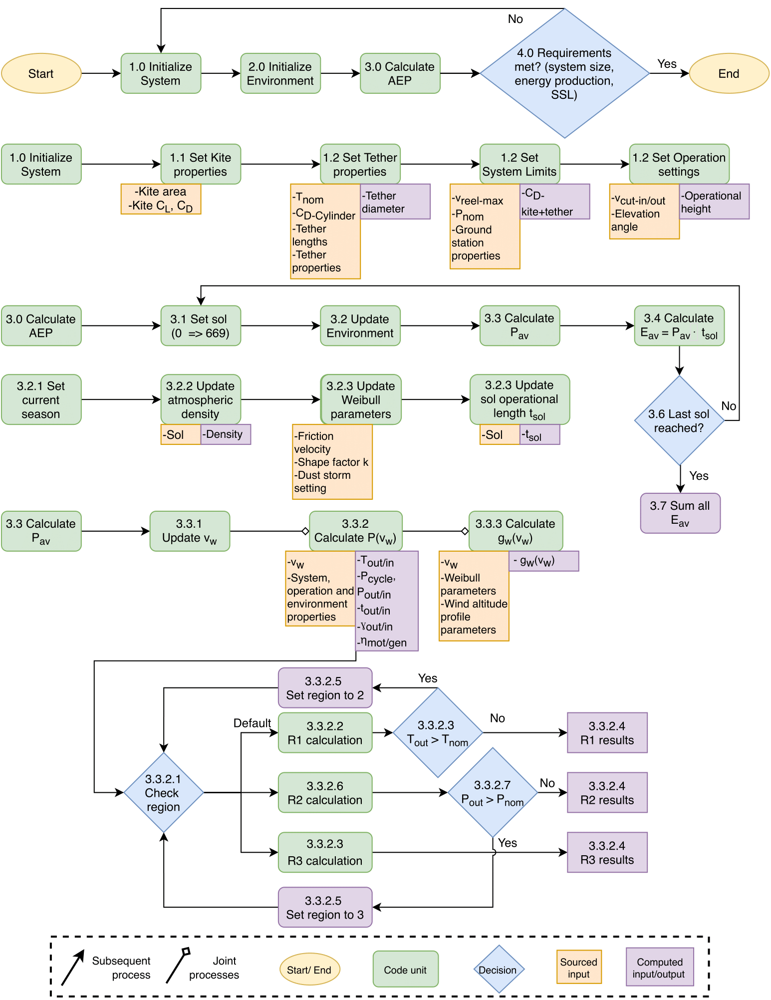

A Python scientific computing tool for design, sizing and optimisation of a pumping power kite system based on [[1-5]](#1), made for the purposes of my BSc thesis.

### About the project
Who would ever think of extracting 'green energy' on the 'Red Planet'? Well, our DSE Group 23 (graduated 2020) did! 

In place of a personal BSc thesis, TU Delft has students enter 10-member teams and work full-time on a Design Synthesis Exercise. Our challenge was to build a renewable energy system for a ['Rhizome' Mars habitat](http://www.roboticbuilding.eu/project/rhizome-development-of-an-autarkic-design-to-robotic-production-and-operation-system-for-building-off-earth-habitats/), under development for an ESA competition. The system's requirements were very stringent on the overall system mass, and over 50% of the energy made must have been from wind. I was responsible for the design and systems engineering of the airborne wind energy (AWE) pumping power kite system, which was the main focus of the project. A part of this was responsibility was producing a Python software tool based on published physical models for the sizing and optimisation of the power kite [[1-5]](#1) with respect to the overall system. 

(ARES = Arcadian Renewable Energy System)

### Final report, published paper, media publications:
[Final report for TU Delft](/thesis_material/DSE2020_group_23_Final_Report.pdf), and our [published paper](https://doi.org/10.7480/spool.2021.2.6058).

[New Scientist: Enormous kites flown by robots could help power a Mars colony](https://lnkd.in/degKFAP)

[BBC: Could kite-flying robots power life on Mars?](https://lnkd.in/ddakpHy)

[Daily Mail: Gigantic 530 sq-ft kites flown by robots could be used to harness Mars's strong winds and power human colonies](https://lnkd.in/d6H32Sc)

[Popular Mechanics: Kite-Flying Robots Could Generate Energy on Mars](https://lnkd.in/dUAM6Qx)

### Code flow diagram:

I had zero experience with the airborne wind energy (AWE) systems before the start of the thesis, and had to put in extra time researching AWE over my weekends as the chief of it - I completely understand why the code flow diagram would be gibberish to anyone who has not marinated themselves full-time in AWE system design for 3 months, the main reason for this being here is to basically flex how much effort was put into programming and consolidating the damn thing.

### Credit, references:
Much of the code was pair-coded by me and Daan Witte as the navigator. I was responsible for the main kite operation model based on Luchsinger [[1]](#1), Daan coded the tether sizing model from Bosman et al. [[2]](#2). Siri Heidweiller helped in these efforts. Fernando Corte Vargas and Bart Klootwijk later on produced a code that included the ground station (motor and generator) model by Fechner and Schmehl [[3]](#3). It was my task to coordinate these efforts on the kite's subsystems, and in the end to consolidate the code into a single sizing tool for the system. Verified, and 'validated' against a similar model of Vlugt et al. [[4]](#4), coded by Mark Schelbergen [[5]](#5). Credit also goes to Lora Ouromova, Esmée Terwindt, Francesca van Marion, Márton Géczi and Marcel Kempers, who have also contributed to the project and their respective subsystems and thus affected the final design. 

Our thanks also goes to our supervisors Roland Schmehl, Dominic von Terzi, Botchu Jyoti and Camila Brito.

### Bibliography:
<a id="1">[1]</a>
R.H. Luchsinger. Pumping cycle kite power. In U. Ahrens, M. Diehl, and R. Schmehl, editors, Airborne Wind Energy, Green Energy and Technology, chapter 3, pages 47–64. Springer, Berlin Heidelberg, 2013. doi: 10.1007/978-3-642-39965-7_3.

<a id="2">[2]</a>
Bosman, V. Reid, M. Vlasblom, and P. Smeets. Airborne wind energy tethers with high-modulus polyethylene fibers. In U. Ahrens, M. Diehl, and R. Schmehl, editors, Airborne Wind Energy, Green Energy and Technology, chapter 33, pages 563–585. Springer, Berlin Heidelberg, 2013. doi: 10.1007/9783642399657_3

<a id="3">[3]</a>
U. Fechner and R. Schmehl. Modelbased efficiency analysis of wind power conversion by a pumping kite power system. In U. Ahrens, M. Diehl, and R. Schmehl, editors, Airborne Wind Energy, Green Energy and Technology, chapter 10, pages 249–269. Springer, Berlin Heidelberg, 2013. doi: 10.1007/978-3-642-39965-7_10

<a id="4">[4]</a>
R. van der Vlugt, A. Bley, R. Schmehl, and M. Noom. Quasisteady model of a pumping kite power
system. Renewable Energy, 131:83–99, 2 2019. doi: 10.1016/j.renene.2018.07.023.

<a id="5">[5]</a>
M. Schelbergen and R. Schmehl. Validation of the quasi-steady performance model for pumping airborne wind energy systems, Journal of Physics: Conference Series 1618-3, 2020. doi: 10.1088/1742-6596/1618/3/032003.
